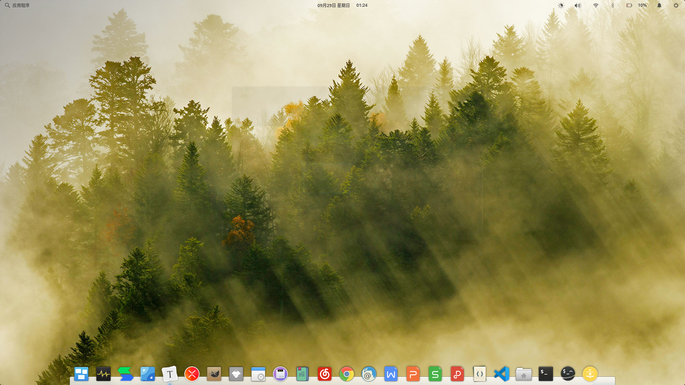
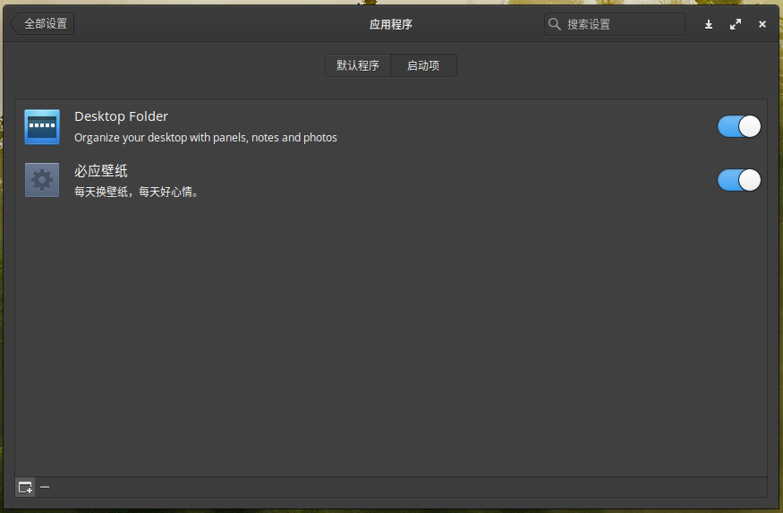

# BingWallpaper
每天获取新的必应壁纸，并设置为桌面背景。

### 环境

- 操作系统：elementary OS 5.0 Juno 基于 Ubuntu 18.04.2 LTS 构建
- Python：3.6.8

### 安装步骤

1. 下载仓库到你的电脑
2. 替换`BingWallpaper.py`和`BingWallpaper.desktop`文件中的路径
3. 拷贝`BingWallpaper.desktop`文件到`~/.config/autostart/`目录下
4. 等待下一次开机或者手动执行`BingWallpaper.py`

### 示例

